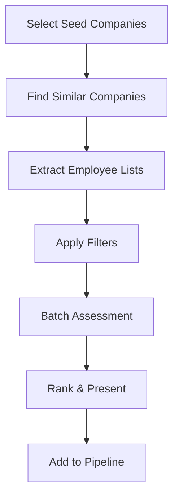

# LinkedIn Profile AI Assessor - Enhancement Plan

## 📋 Project Overview
Transform the LinkedIn Profile AI Assessor into a comprehensive recruitment intelligence platform with Chrome extension integration, job template management, and automated talent discovery.

## 🎯 Core Enhancement Areas

1. **Chrome Extension Integration** - One-click profile addition from LinkedIn
2. **Job Template Management** - Store and reuse job descriptions with AI-extracted requirements
3. **Company-Based Talent Discovery** - Auto-discover talent from target companies
4. **Enhanced Assessment Intelligence** - Context-aware scoring based on job requirements
5. **Workflow Automation** - Reduce manual work through intelligent automation

---

## 📅 Phase 1: Chrome Extension Development (Week 1-2)

### Chrome Extension Features
- [ ] **"Add to Assessor" button** on LinkedIn profiles
- [ ] **Quick Actions Menu**:
  - [ ] Add to List
  - [ ] Run Analysis
  - [ ] Add to Job
- [ ] **Profile Data Extraction** from DOM (saves API calls)
- [ ] **Batch Operations** from LinkedIn search results
- [ ] **List Management** - Create/select recruiter lists

### Backend API Extensions
- [ ] `POST /extension/add-profile` - Quick add with minimal data
- [ ] `POST /extension/quick-assess` - Instant assessment from extension
- [ ] `GET /extension/lists` - Get recruiter's saved lists
- [ ] `POST /extension/create-list` - Create new candidate list
- [ ] `GET /extension/auth` - Validate extension user

### Database Schema Updates
```sql
-- Recruiter lists for organizing candidates
CREATE TABLE recruiter_lists (
  id UUID PRIMARY KEY DEFAULT gen_random_uuid(),
  recruiter_name VARCHAR(255) NOT NULL,
  list_name VARCHAR(255) NOT NULL,
  job_template_id UUID REFERENCES job_templates(id),
  created_at TIMESTAMP DEFAULT NOW(),
  updated_at TIMESTAMP DEFAULT NOW(),
  is_active BOOLEAN DEFAULT true
);

-- Quick-add profiles from extension
CREATE TABLE extension_profiles (
  id UUID PRIMARY KEY DEFAULT gen_random_uuid(),
  linkedin_url VARCHAR(255) UNIQUE NOT NULL,
  name VARCHAR(255),
  headline TEXT,
  current_company VARCHAR(255),
  current_title VARCHAR(255),
  location VARCHAR(255),
  list_id UUID REFERENCES recruiter_lists(id),
  needs_full_fetch BOOLEAN DEFAULT true,
  added_via VARCHAR(50) DEFAULT 'extension',
  added_at TIMESTAMP DEFAULT NOW()
);
```

### Chrome Extension Structure
```
/chrome-extension/
├── manifest.json           # V3 manifest
├── popup/
│   ├── popup.html         # Extension popup UI
│   ├── popup.js           # Popup logic
│   └── popup.css          # Styling
├── content/
│   ├── content.js         # LinkedIn page interaction
│   └── linkedin-parser.js # DOM scraping logic
├── background/
│   └── service-worker.js  # API communication
├── options/
│   ├── options.html       # Settings page
│   └── options.js         # Settings logic
└── icons/                 # Extension icons
    ├── icon16.png
    ├── icon48.png
    └── icon128.png
```

---

## 📝 Phase 2: Job Template System (Week 2-3)

### Job Template Features
- [ ] **Template CRUD Operations**
  - [ ] Create from job description
  - [ ] Edit requirements and weights
  - [ ] Archive old templates
  - [ ] Clone existing templates
- [ ] **AI Requirement Extraction**
  - [ ] Parse job descriptions
  - [ ] Extract key requirements
  - [ ] Suggest weight distributions
  - [ ] Generate assessment criteria
- [ ] **Visual Weight Editor**
  - [ ] Drag-and-drop prioritization
  - [ ] Percentage sliders
  - [ ] Real-time preview
- [ ] **Template Library**
  - [ ] Search and filter
  - [ ] Categories and tags
  - [ ] Version history

### Database Schema
```sql
-- Job templates with extracted requirements
CREATE TABLE job_templates (
  id UUID PRIMARY KEY DEFAULT gen_random_uuid(),
  title VARCHAR(255) NOT NULL,
  department VARCHAR(100),
  level VARCHAR(50), -- junior, mid, senior, staff, principal
  description TEXT,
  requirements JSONB, -- AI-extracted requirements
  weighted_criteria JSONB, -- {criterion: weight_percentage}
  company_context TEXT,
  skills_required TEXT[],
  skills_preferred TEXT[],
  years_experience_min INTEGER,
  years_experience_max INTEGER,
  created_by VARCHAR(255),
  created_at TIMESTAMP DEFAULT NOW(),
  updated_at TIMESTAMP DEFAULT NOW(),
  is_active BOOLEAN DEFAULT true,
  version INTEGER DEFAULT 1,
  parent_template_id UUID REFERENCES job_templates(id)
);

-- Link assessments to job templates
CREATE TABLE job_assessments (
  id UUID PRIMARY KEY DEFAULT gen_random_uuid(),
  candidate_linkedin_url VARCHAR(255) NOT NULL,
  job_template_id UUID REFERENCES job_templates(id),
  assessment_data JSONB,
  weighted_scores JSONB,
  match_percentage FLOAT,
  strengths TEXT[],
  gaps TEXT[],
  assessed_at TIMESTAMP DEFAULT NOW(),
  assessed_by VARCHAR(255)
);
```

### API Endpoints
- [ ] `POST /jobs/create` - Create new template
- [ ] `POST /jobs/parse` - Parse job description with AI
- [ ] `GET /jobs/list` - List all templates
- [ ] `GET /jobs/{id}` - Get specific template
- [ ] `PUT /jobs/{id}` - Update template
- [ ] `DELETE /jobs/{id}` - Archive template
- [ ] `POST /jobs/{id}/clone` - Clone template
- [ ] `POST /jobs/{id}/assess` - Assess candidate against template

---

## 🏢 Phase 3: Company-Based Talent Discovery (Week 3-4)

### Discovery Features
- [ ] **Company Selection**
  - [ ] Search companies by name
  - [ ] Filter by industry/size/location
  - [ ] Select competitors
  - [ ] Import company lists
- [ ] **Similar Company Finding**
  - [ ] Industry matching
  - [ ] Size/stage matching
  - [ ] Location proximity
  - [ ] Technology stack similarity
- [ ] **Talent Pipeline**
  - [ ] Scrape employees from companies
  - [ ] Filter by role/seniority/department
  - [ ] Batch assessment
  - [ ] Ranking and scoring

### API Integration Options

#### Option 1: Crunchbase API (Premium)
```python
# Example integration
def find_similar_companies(company_name):
    """Find similar companies using Crunchbase"""
    # Requires $499/month subscription
    response = crunchbase_api.organizations.search(
        field_ids=["identifier", "short_description", "num_employees_enum"],
        query=[{
            "type": "predicate",
            "field_id": "categories",
            "operator_id": "includes",
            "values": get_company_categories(company_name)
        }]
    )
    return response.entities
```

#### Option 2: CoreSignal Company Search (Cost-effective)
```python
# Use existing CoreSignal API
def find_similar_companies(company_id):
    """Find similar companies using CoreSignal"""
    company = coresignal.get_company(company_id)
    return coresignal.search_companies({
        "industry": company["industry"],
        "employee_count_range": get_size_range(company["employee_count"]),
        "location": company["hq_location"]
    })
```

### Discovery Workflow


### Database Schema
```sql
-- Company discovery sessions
CREATE TABLE discovery_sessions (
  id UUID PRIMARY KEY DEFAULT gen_random_uuid(),
  session_name VARCHAR(255),
  seed_companies TEXT[],
  similar_companies JSONB,
  filters JSONB,
  job_template_id UUID REFERENCES job_templates(id),
  discovered_count INTEGER DEFAULT 0,
  assessed_count INTEGER DEFAULT 0,
  created_by VARCHAR(255),
  created_at TIMESTAMP DEFAULT NOW()
);

-- Discovered candidates
CREATE TABLE discovered_candidates (
  id UUID PRIMARY KEY DEFAULT gen_random_uuid(),
  discovery_session_id UUID REFERENCES discovery_sessions(id),
  linkedin_url VARCHAR(255),
  source_company VARCHAR(255),
  match_score FLOAT,
  assessment_id UUID,
  added_to_pipeline BOOLEAN DEFAULT false,
  discovered_at TIMESTAMP DEFAULT NOW()
);
```

---

## 🧠 Phase 4: Enhanced Intelligence (Week 4-5)

### Contextual Scoring System
- [ ] **Role-Specific Weights**
  ```python
  scoring_profiles = {
      "engineering": {
          "technical_skills": 0.4,
          "experience": 0.3,
          "leadership": 0.2,
          "culture_fit": 0.1
      },
      "sales": {
          "track_record": 0.4,
          "communication": 0.3,
          "industry_knowledge": 0.2,
          "technical_skills": 0.1
      }
  }
  ```

- [ ] **Industry Experience Bonuses**
  - Same industry: +15% bonus
  - Adjacent industry: +8% bonus
  - Transferable skills: +5% bonus

- [ ] **Company Culture Fit**
  - Startup → Startup: High fit
  - Enterprise → Startup: Medium fit
  - Consider company stage transitions

### Advanced Matching Features
- [ ] **Skill Gap Analysis**
  ```python
  def analyze_skill_gaps(candidate_skills, required_skills):
      return {
          "has": set(candidate_skills) & set(required_skills),
          "missing": set(required_skills) - set(candidate_skills),
          "additional": set(candidate_skills) - set(required_skills),
          "match_percentage": calculate_overlap_percentage()
      }
  ```

- [ ] **Growth Potential Scoring**
  - Career progression velocity
  - Learning indicator signals
  - Leadership emergence patterns

- [ ] **Team Composition Analysis**
  - Skills diversity assessment
  - Seniority balance
  - Cultural add vs. cultural fit

### Reporting & Analytics
- [ ] **Comparison Matrix View**
  - Side-by-side candidate comparison
  - Weighted criteria visualization
  - Strengths/gaps overlay

- [ ] **Pipeline Analytics Dashboard**
  - Funnel conversion rates
  - Source effectiveness
  - Time-to-hire metrics
  - Drop-off analysis

- [ ] **Predictive Analytics**
  - Success probability scoring
  - Time-to-fill predictions
  - Optimal sourcing channel recommendations

---

## ⚡ Phase 5: Automation & Optimization (Week 5-6)

### Automation Features
- [ ] **Daily Digest System**
  ```python
  # Daily job that runs at 9 AM
  def send_daily_digest():
      new_matches = find_new_high_matches()
      profile_updates = get_profile_changes()
      pipeline_summary = generate_pipeline_stats()

      send_email_digest({
          "new_matches": new_matches,
          "updates": profile_updates,
          "summary": pipeline_summary
      })
  ```

- [ ] **Auto-Refresh Rules**
  - Profiles > 90 days: Force refresh
  - High-priority candidates: Weekly refresh
  - Archived candidates: No refresh

- [ ] **Threshold Alerts**
  - Match score > 85%: Immediate notification
  - New senior candidate: Alert hiring manager
  - Competitor employee available: Priority flag

- [ ] **Batch Scheduling**
  - Queue large batches for off-peak
  - Distribute API calls to avoid limits
  - Retry failed assessments automatically

### Performance Optimizations
- [ ] **Database Optimizations**
  ```sql
  -- Add indexes for common queries
  CREATE INDEX idx_assessments_weighted_score ON candidate_assessments(weighted_score DESC);
  CREATE INDEX idx_profiles_linkedin_url ON extension_profiles(linkedin_url);
  CREATE INDEX idx_templates_active ON job_templates(is_active, created_at DESC);
  ```

- [ ] **Caching Strategy**
  - Redis for session data
  - Profile cache: 3-day freshness
  - Company cache: 30-day freshness
  - Assessment cache: 7-day validity

- [ ] **Frontend Optimizations**
  - Lazy load candidate cards
  - Virtual scrolling for large lists
  - Progressive image loading
  - Code splitting by route

---

## 🏗️ Technical Implementation Details

### Chrome Extension Manifest (V3)
```json
{
  "manifest_version": 3,
  "name": "LinkedIn Profile AI Assessor",
  "version": "1.0.0",
  "description": "One-click profile assessment from LinkedIn",
  "permissions": [
    "storage",
    "tabs",
    "activeTab"
  ],
  "host_permissions": [
    "https://www.linkedin.com/*",
    "http://localhost:5001/*",
    "https://your-app-domain.com/*"
  ],
  "background": {
    "service_worker": "background/service-worker.js"
  },
  "content_scripts": [{
    "matches": ["https://www.linkedin.com/*"],
    "js": ["content/content.js", "content/linkedin-parser.js"],
    "css": ["content/content.css"]
  }],
  "action": {
    "default_popup": "popup/popup.html",
    "default_icon": {
      "16": "icons/icon16.png",
      "48": "icons/icon48.png",
      "128": "icons/icon128.png"
    }
  },
  "options_page": "options/options.html"
}
```

### Backend Service Architecture
```python
# /backend/services/job_template_service.py
class JobTemplateService:
    def create_template(self, job_description: str, created_by: str):
        # Extract requirements using Claude AI
        requirements = self.extract_requirements(job_description)
        weights = self.suggest_weights(requirements)

        template = {
            "description": job_description,
            "requirements": requirements,
            "weighted_criteria": weights,
            "created_by": created_by
        }

        return self.save_template(template)

    def extract_requirements(self, job_description: str):
        prompt = f"""Extract key requirements from this job description:
        {job_description}

        Return JSON with:
        - required_skills: []
        - preferred_skills: []
        - years_experience: {{min: X, max: Y}}
        - education_level: ""
        - key_responsibilities: []
        """

        return claude_ai.extract(prompt)
```

### Frontend Component Structure
```javascript
// /frontend/src/components/JobTemplates/TemplateManager.js
const TemplateManager = () => {
    const [templates, setTemplates] = useState([]);
    const [selectedTemplate, setSelectedTemplate] = useState(null);

    return (
        <div className="template-manager">
            <TemplateList
                templates={templates}
                onSelect={setSelectedTemplate}
            />
            <TemplateEditor
                template={selectedTemplate}
                onSave={handleSave}
            />
            <WeightDistribution
                weights={selectedTemplate?.weighted_criteria}
                onChange={handleWeightChange}
            />
        </div>
    );
};
```

---

## 📊 Success Metrics & KPIs

### Efficiency Metrics
| Metric | Current | Target | Improvement |
|--------|---------|--------|-------------|
| Time to assess (single) | 2 min | 30 sec | 75% ↓ |
| Profiles/day/recruiter | 20 | 60 | 200% ↑ |
| Manual data entry | 5 min | 1 min | 80% ↓ |
| Batch processing | 50/hour | 200/hour | 300% ↑ |

### Quality Metrics
| Metric | Current | Target | Improvement |
|--------|---------|--------|-------------|
| Assessment accuracy | 75% | 90% | 20% ↑ |
| False positive rate | 15% | 5% | 67% ↓ |
| Hire success rate | 60% | 80% | 33% ↑ |

### Cost Metrics
| Metric | Current | Target | Savings |
|--------|---------|--------|---------|
| CoreSignal API/month | $500 | $300 | $200 |
| Cost per assessment | $0.50 | $0.20 | $0.30 |
| Cache hit rate | 40% | 80% | 2x |

---

## 🚨 Risk Management

### Compliance & Legal
- [ ] LinkedIn ToS compliance review
- [ ] GDPR/CCPA compliance audit
- [ ] Data retention policies
- [ ] User consent workflows

### Technical Risks
- [ ] API rate limiting strategy
- [ ] Fallback for service outages
- [ ] Data backup procedures
- [ ] Security audit

### Business Risks
- [ ] User training materials
- [ ] Change management plan
- [ ] Rollback procedures
- [ ] Cost monitoring

---

## 🚀 Quick Wins (Implement First)

1. **Basic Chrome Extension** (2 days)
   - Simple "Add to List" button
   - No assessment, just bookmarking
   - Manual batch process later

2. **Job Template Storage** (1 day)
   - CRUD without AI extraction
   - Manual requirement entry
   - Basic weight sliders

3. **Bulk Feedback Import** (4 hours)
   - CSV upload for feedback
   - Map to existing candidates
   - Simple validation

4. **Enhanced Filtering** (4 hours)
   - Score range filters
   - Requirement-specific sorting
   - Export filtered results

5. **PDF Export** (4 hours)
   - Assessment report generation
   - Branded templates
   - Email delivery

---

## 📅 Sprint Plan

### Sprint 1 (Week 1)
- [x] Set up dev branch
- [ ] Create Chrome extension structure
- [ ] Basic popup interface
- [ ] LinkedIn DOM parser
- [ ] Backend extension endpoints

### Sprint 2 (Week 2)
- [ ] Complete extension MVP
- [ ] Job template CRUD
- [ ] Basic template UI
- [ ] Database migrations

### Sprint 3 (Week 3)
- [ ] AI requirement extraction
- [ ] Weight editor UI
- [ ] Company discovery MVP
- [ ] Similar company finder

### Sprint 4 (Week 4)
- [ ] Enhanced scoring system
- [ ] Comparison matrix
- [ ] Analytics dashboard
- [ ] Pipeline metrics

### Sprint 5 (Week 5)
- [ ] Automation rules engine
- [ ] Daily digest system
- [ ] Performance optimizations
- [ ] Testing & debugging

### Sprint 6 (Week 6)
- [ ] Polish and refine
- [ ] Documentation
- [ ] User training materials
- [ ] Production deployment

---

## 📝 Notes & Decisions

### Why Chrome Extension?
- Eliminates manual URL copying
- Enables batch operations
- Provides better UX
- Reduces assessment time by 75%

### Why Job Templates?
- Ensures consistent evaluation
- Saves time on criteria creation
- Enables comparative analysis
- Improves assessment quality

### Why Company Discovery?
- Proactive talent sourcing
- Competitive intelligence
- Pipeline building
- Market mapping

### Architecture Decisions
- Manifest V3 for future-proofing
- Supabase for real-time sync
- Redis for high-performance caching
- React for component reusability

---

## 🔄 Status Updates

### 2024-10-24
- ✅ Created dev/enhancements branch
- ✅ Created comprehensive plan.md
- 🔄 Starting Chrome extension implementation

---

## 📚 Resources

### Documentation
- [Chrome Extension Development](https://developer.chrome.com/docs/extensions/)
- [Supabase Database](https://supabase.com/docs)
- [CoreSignal API](https://docs.coresignal.com/)
- [Claude AI API](https://docs.anthropic.com/)

### Design Resources
- [Figma Mockups](https://figma.com/your-mockups)
- [Component Library](https://your-components.com)
- [Brand Guidelines](https://your-brand.com)

### Team Contacts
- Product: product@team.com
- Engineering: eng@team.com
- Design: design@team.com

---

## ✅ Checklist Before Production

- [ ] All tests passing
- [ ] Security audit complete
- [ ] Performance benchmarks met
- [ ] Documentation updated
- [ ] User training complete
- [ ] Rollback plan ready
- [ ] Monitoring in place
- [ ] Legal review complete

---

*This plan is a living document and will be updated as we progress through implementation.*