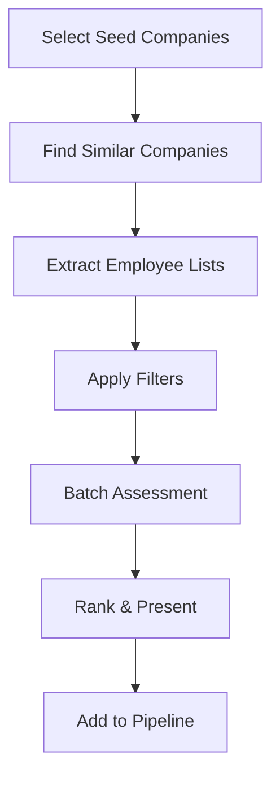

# LinkedIn Profile AI Assessor - Enhancement Plan

## 📋 Project Overview
Transform the LinkedIn Profile AI Assessor into a comprehensive recruitment intelligence platform with Chrome extension integration, job template management, and automated talent discovery.

## 🎯 Core Enhancement Areas

1. **Chrome Extension Integration** - One-click profile addition from LinkedIn
2. **Job Template Management** - Store and reuse job descriptions with AI-extracted requirements
3. **Company-Based Talent Discovery** - Auto-discover talent from target companies
4. **Enhanced Assessment Intelligence** - Context-aware scoring based on job requirements
5. **Workflow Automation** - Reduce manual work through intelligent automation

---

## 📅 Phase 1: Chrome Extension Development (Week 1-2) ⚠️ PARTIALLY COMPLETE

### Implementation Status

**✅ Completed:**
- Chrome extension with "Add to List" functionality
- Profile data extraction from LinkedIn DOM
- Complete backend API (11 endpoints total)
- Database schema with new tables
- List management and statistics API
- Documentation (API reference, testing guide, quick start)

**❌ Missing (Critical Gap Identified):**
- **Frontend UI to view/manage lists created from extension**
- Without this, users can bookmark profiles but cannot view them in the web app
- Lists are stored in database but invisible to users
- **This breaks the complete workflow loop**

### Implementation Notes & Deviations

**✅ Implemented as Planned:**
- Chrome extension with "Add to List" functionality
- Profile data extraction from LinkedIn DOM
- Complete backend API (11 endpoints total)
- Database schema with new tables
- List management and statistics

**🔄 Changed from Original Plan:**
1. **Removed:** `POST /extension/quick-assess` endpoint
   - Original: Instant single-profile assessment from extension
   - Changed to: Two-stage approach (bookmark now, assess later in batch)
   - Reason: More efficient API usage, better UX for batch operations

2. **Added:** `GET /lists/{id}/export-csv` endpoint
   - Not in original plan
   - Enables complete workflow → LinkedIn Recruiter integration
   - User requested: "Have them directly pulled into LinkedIn recruiter project"

3. **Deferred:** Batch operations from LinkedIn search results
   - Marked as "Future enhancement"
   - Focus on core workflow first

**⚠️ Critical Issue Discovered:**
- **No frontend UI for lists management**
- Extension creates lists → stored in database → **no way to view in web app**
- Must add "Lists" mode to frontend before Phase 1 is truly complete

**🎯 Phase 1 Partial Deliverables:**
- ✅ Chrome extension (complete and functional)
- ✅ Backend API (11 endpoints)
- ✅ Database schema (3 new tables)
- ❌ Frontend Lists UI (MISSING - see Phase 1.5)
- ✅ Documentation (API reference, testing guide, quick start)

### Chrome Extension Features
- [x] **"Add to Assessor" button** on LinkedIn profiles ✅
- [x] **Quick Actions Menu**: ✅
  - [x] Add to List ✅
  - [x] Run Analysis ✅
  - [ ] Add to Job (Phase 2)
- [x] **Profile Data Extraction** from DOM (saves API calls) ✅
- [ ] **Batch Operations** from LinkedIn search results (Future enhancement)
- [x] **List Management** - Create/select recruiter lists ✅

### Backend API Extensions
- [x] `POST /extension/add-profile` - Quick add with minimal data ✅
- [x] `GET /extension/lists` - Get recruiter's saved lists ✅
- [x] `POST /extension/create-list` - Create new candidate list ✅
- [x] `PUT /extension/lists/{id}` - Update list details ✅
- [x] `DELETE /extension/lists/{id}` - Archive list ✅
- [x] `GET /extension/lists/{id}/stats` - List statistics ✅
- [x] `GET /extension/profiles/{id}` - Get profiles with filters ✅
- [x] `PUT /extension/profiles/{id}/status` - Update status ✅
- [x] `GET /extension/auth` - Validate extension user ✅
- [x] **NEW:** `POST /lists/{id}/assess` - Batch assess all profiles in list ✅
- [x] **NEW:** `GET /lists/{id}/export-csv` - Export to LinkedIn Recruiter CSV ✅

### Database Schema Updates
```sql
-- Recruiter lists for organizing candidates
CREATE TABLE recruiter_lists (
  id UUID PRIMARY KEY DEFAULT gen_random_uuid(),
  recruiter_name VARCHAR(255) NOT NULL,
  list_name VARCHAR(255) NOT NULL,
  job_template_id UUID REFERENCES job_templates(id),
  created_at TIMESTAMP DEFAULT NOW(),
  updated_at TIMESTAMP DEFAULT NOW(),
  is_active BOOLEAN DEFAULT true
);

-- Quick-add profiles from extension
CREATE TABLE extension_profiles (
  id UUID PRIMARY KEY DEFAULT gen_random_uuid(),
  linkedin_url VARCHAR(255) UNIQUE NOT NULL,
  name VARCHAR(255),
  headline TEXT,
  current_company VARCHAR(255),
  current_title VARCHAR(255),
  location VARCHAR(255),
  list_id UUID REFERENCES recruiter_lists(id),
  needs_full_fetch BOOLEAN DEFAULT true,
  added_via VARCHAR(50) DEFAULT 'extension',
  added_at TIMESTAMP DEFAULT NOW()
);
```

### Chrome Extension Structure
```
/chrome-extension/
├── manifest.json           # V3 manifest
├── popup/
│   ├── popup.html         # Extension popup UI
│   ├── popup.js           # Popup logic
│   └── popup.css          # Styling
├── content/
│   ├── content.js         # LinkedIn page interaction
│   └── linkedin-parser.js # DOM scraping logic
├── background/
│   └── service-worker.js  # API communication
├── options/
│   ├── options.html       # Settings page
│   └── options.js         # Settings logic
└── icons/                 # Extension icons
    ├── icon16.png
    ├── icon48.png
    └── icon128.png
```

---

## 📅 Phase 1.5: Frontend Lists UI (URGENT - Week 1.5) 🚨 IN PROGRESS

### Critical Gap to Fill

**Problem:** Chrome extension creates lists and adds profiles, but there's no UI in the web app to view/manage them!

**Current Frontend Modes:**
1. ✅ Single Profile - Assess one LinkedIn URL
2. ✅ Batch Mode - Upload CSV with multiple URLs
3. ✅ Search Mode - Natural language LinkedIn search

**Missing:** 4th mode called "Lists" to view extension-created data

### Frontend Components to Build

**New Components:**
- [ ] `components/ListsView.js` - Dashboard showing all lists as cards
- [ ] `components/ListCard.js` - Individual list card component
- [ ] `components/ListDetail.js` - View profiles within a selected list
- [ ] `components/ListsView.css` - Styling for lists UI

**Modified Files:**
- [ ] `App.js` - Add "Lists" mode toggle button (4th mode)
- [ ] `App.css` - Update mode toggle styles for 4 buttons

### Features to Implement

**Lists Dashboard View:**
- Display all lists as grid of cards
- Each card shows: name, description, profile count, assessed count, avg score
- Click card → navigate to List Detail view
- API: `GET /extension/lists?recruiter_name={name}`

**List Detail View:**
- Show all profiles in selected list
- Separate assessed vs unassessed profiles
- "Assess All" button → `POST /lists/{id}/assess`
- "Export CSV" button → `GET /lists/{id}/export-csv`
- Individual profile cards (reuse existing candidate card component)
- API: `GET /extension/profiles/{list_id}`

**Profile Assessment:**
- Click "Assess All" triggers batch assessment
- Show progress indicator during assessment
- Update UI with scores when complete
- Reuse existing assessment display components

**CSV Export:**
- Click "Export CSV" downloads file
- Format: LinkedIn Recruiter compatible
- Show success notification
- Track export in database

### User Flow

```
┌──────────────────────┐
│ Chrome Extension     │
│ (Bookmark profiles)  │
└──────────┬───────────┘
           │
           ↓
┌──────────────────────┐
│ Render Backend       │
│ (Store in database)  │
└──────────┬───────────┘
           │
           ↓
┌──────────────────────┐
│ Frontend Lists UI    │ ← NEW!
│ (View/manage lists)  │
└──────────┬───────────┘
           │
           ↓
┌──────────────────────┐
│ Assess All Profiles  │
│ (CoreSignal + AI)    │
└──────────┬───────────┘
           │
           ↓
┌──────────────────────┐
│ Export to CSV        │
│ (LinkedIn Recruiter) │
└──────────────────────┘
```

### API Integration (No Backend Changes Needed)

**All endpoints already exist:**
- ✅ `GET /extension/lists?recruiter_name={name}` - Get all lists
- ✅ `GET /extension/profiles/{list_id}` - Get profiles in list
- ✅ `GET /extension/lists/{id}/stats` - Get list statistics
- ✅ `POST /lists/{id}/assess` - Batch assess all profiles
- ✅ `GET /lists/{id}/export-csv` - Export to LinkedIn Recruiter CSV
- ✅ `DELETE /extension/lists/{id}` - Delete/archive list

### Implementation Plan

**Step 1: Add Lists Mode to App.js**
- Add "Lists" button to mode toggle (4th button)
- Add state: `listsMode`, `selectedList`, `lists`, `listProfiles`
- Add conditional rendering for Lists mode

**Step 2: Create ListsView Component**
- Fetch lists on mount: `GET /extension/lists?recruiter_name={name}`
- Display lists as grid of cards
- Handle loading and error states
- Click handler to select list

**Step 3: Create ListCard Component**
- Display list name, description
- Show stats: profile count, assessed count, avg score
- Color-coded based on assessment status
- Click to open list detail

**Step 4: Create ListDetail Component**
- Fetch profiles: `GET /extension/profiles/{list_id}`
- Display profiles in two sections: Assessed | Unassessed
- "Assess All" button with progress indicator
- "Export CSV" button with download
- Back button to return to lists dashboard

**Step 5: Wire Up Assessment**
- Click "Assess All" → show loading overlay
- Call `POST /lists/{id}/assess` with requirements
- Poll or wait for response
- Refresh profile list to show scores
- Show success notification

**Step 6: Wire Up CSV Export**
- Click "Export CSV" → call `GET /lists/{id}/export-csv`
- Trigger browser download
- Show success notification
- Optional: filter by min score

**Step 7: Integrate with Existing Components**
- Reuse candidate card component for profile display
- Reuse assessment results display
- Reuse recruiter feedback system
- Reuse company enrichment tooltips

### UI Mockup

**Lists Dashboard:**
```
┌─────────────────────────────────────────────────┐
│ Mode: [Single] [Batch] [Search] [Lists ●]      │
└─────────────────────────────────────────────────┘

Your Candidate Lists

┌──────────────┐ ┌──────────────┐ ┌──────────────┐
│ Senior Eng   │ │ PMs          │ │ Designers    │
│ 12 profiles  │ │ 8 profiles   │ │ 5 profiles   │
│ 8 assessed   │ │ 3 assessed   │ │ 0 assessed   │
│ Avg: 85/100  │ │ Avg: 78/100  │ │ Not assessed │
│ [Open List]  │ │ [Open List]  │ │ [Open List]  │
└──────────────┘ └──────────────┘ └──────────────┘

[+ Create New List]
```

**List Detail:**
```
┌─────────────────────────────────────────────────┐
│ ← Back to Lists                                 │
│                                                 │
│ Senior Engineers (12 profiles)                 │
│ [Assess All Unassessed] [Export CSV] [Delete]  │
└─────────────────────────────────────────────────┘

✅ Assessed (8 profiles)

┌──────────────────────────────────────────────────┐
│ Satya Nadella                                    │
│ Chairman and CEO at Microsoft                    │
│ Score: 92/100 | Added: Oct 24                    │
│ [View Full Assessment] [Remove from List]        │
└──────────────────────────────────────────────────┘

⏳ Not Assessed (4 profiles)

┌──────────────────────────────────────────────────┐
│ Jeff Weiner                                      │
│ Partner at Greylock                              │
│ Added: Oct 24                                    │
│ [Assess This Profile] [Remove from List]         │
└──────────────────────────────────────────────────┘
```

### Deliverables

- [ ] Lists mode toggle button in App.js
- [ ] ListsView component (lists dashboard)
- [ ] ListCard component (individual list card)
- [ ] ListDetail component (profiles in list)
- [ ] CSS styling for lists UI
- [ ] Integration with existing assessment display
- [ ] "Assess All" functionality
- [ ] "Export CSV" functionality
- [ ] Navigation between views
- [ ] Loading states and error handling

### Success Criteria

✅ User can view all lists created from Chrome extension
✅ User can click a list to see profiles inside
✅ User can assess all profiles in a list at once
✅ User can export assessed profiles to CSV
✅ User can remove profiles from lists
✅ User can delete lists
✅ Complete workflow loop: Extension → Lists UI → Assess → Export

### Estimated Time

- UI Components: 2-3 hours
- API Integration: 1 hour
- Testing & Polish: 1 hour
- **Total: 4-5 hours**

---

## 📝 Phase 2: Job Template System (Week 2-3)

### Job Template Features
- [ ] **Template CRUD Operations**
  - [ ] Create from job description
  - [ ] Edit requirements and weights
  - [ ] Archive old templates
  - [ ] Clone existing templates
- [ ] **AI Requirement Extraction**
  - [ ] Parse job descriptions
  - [ ] Extract key requirements
  - [ ] Suggest weight distributions
  - [ ] Generate assessment criteria
- [ ] **Visual Weight Editor**
  - [ ] Drag-and-drop prioritization
  - [ ] Percentage sliders
  - [ ] Real-time preview
- [ ] **Template Library**
  - [ ] Search and filter
  - [ ] Categories and tags
  - [ ] Version history

### Database Schema
```sql
-- Job templates with extracted requirements
CREATE TABLE job_templates (
  id UUID PRIMARY KEY DEFAULT gen_random_uuid(),
  title VARCHAR(255) NOT NULL,
  department VARCHAR(100),
  level VARCHAR(50), -- junior, mid, senior, staff, principal
  description TEXT,
  requirements JSONB, -- AI-extracted requirements
  weighted_criteria JSONB, -- {criterion: weight_percentage}
  company_context TEXT,
  skills_required TEXT[],
  skills_preferred TEXT[],
  years_experience_min INTEGER,
  years_experience_max INTEGER,
  created_by VARCHAR(255),
  created_at TIMESTAMP DEFAULT NOW(),
  updated_at TIMESTAMP DEFAULT NOW(),
  is_active BOOLEAN DEFAULT true,
  version INTEGER DEFAULT 1,
  parent_template_id UUID REFERENCES job_templates(id)
);

-- Link assessments to job templates
CREATE TABLE job_assessments (
  id UUID PRIMARY KEY DEFAULT gen_random_uuid(),
  candidate_linkedin_url VARCHAR(255) NOT NULL,
  job_template_id UUID REFERENCES job_templates(id),
  assessment_data JSONB,
  weighted_scores JSONB,
  match_percentage FLOAT,
  strengths TEXT[],
  gaps TEXT[],
  assessed_at TIMESTAMP DEFAULT NOW(),
  assessed_by VARCHAR(255)
);
```

### API Endpoints
- [ ] `POST /jobs/create` - Create new template
- [ ] `POST /jobs/parse` - Parse job description with AI
- [ ] `GET /jobs/list` - List all templates
- [ ] `GET /jobs/{id}` - Get specific template
- [ ] `PUT /jobs/{id}` - Update template
- [ ] `DELETE /jobs/{id}` - Archive template
- [ ] `POST /jobs/{id}/clone` - Clone template
- [ ] `POST /jobs/{id}/assess` - Assess candidate against template

---

## 🏢 Phase 3: Company-Based Talent Discovery (Week 3-4)

### Discovery Features
- [ ] **Company Selection**
  - [ ] Search companies by name
  - [ ] Filter by industry/size/location
  - [ ] Select competitors
  - [ ] Import company lists
- [ ] **Similar Company Finding**
  - [ ] Industry matching
  - [ ] Size/stage matching
  - [ ] Location proximity
  - [ ] Technology stack similarity
- [ ] **Talent Pipeline**
  - [ ] Scrape employees from companies
  - [ ] Filter by role/seniority/department
  - [ ] Batch assessment
  - [ ] Ranking and scoring

### API Integration Options

#### Option 1: Crunchbase API (Premium)
```python
# Example integration
def find_similar_companies(company_name):
    """Find similar companies using Crunchbase"""
    # Requires $499/month subscription
    response = crunchbase_api.organizations.search(
        field_ids=["identifier", "short_description", "num_employees_enum"],
        query=[{
            "type": "predicate",
            "field_id": "categories",
            "operator_id": "includes",
            "values": get_company_categories(company_name)
        }]
    )
    return response.entities
```

#### Option 2: CoreSignal Company Search (Cost-effective)
```python
# Use existing CoreSignal API
def find_similar_companies(company_id):
    """Find similar companies using CoreSignal"""
    company = coresignal.get_company(company_id)
    return coresignal.search_companies({
        "industry": company["industry"],
        "employee_count_range": get_size_range(company["employee_count"]),
        "location": company["hq_location"]
    })
```

### Discovery Workflow


### Database Schema
```sql
-- Company discovery sessions
CREATE TABLE discovery_sessions (
  id UUID PRIMARY KEY DEFAULT gen_random_uuid(),
  session_name VARCHAR(255),
  seed_companies TEXT[],
  similar_companies JSONB,
  filters JSONB,
  job_template_id UUID REFERENCES job_templates(id),
  discovered_count INTEGER DEFAULT 0,
  assessed_count INTEGER DEFAULT 0,
  created_by VARCHAR(255),
  created_at TIMESTAMP DEFAULT NOW()
);

-- Discovered candidates
CREATE TABLE discovered_candidates (
  id UUID PRIMARY KEY DEFAULT gen_random_uuid(),
  discovery_session_id UUID REFERENCES discovery_sessions(id),
  linkedin_url VARCHAR(255),
  source_company VARCHAR(255),
  match_score FLOAT,
  assessment_id UUID,
  added_to_pipeline BOOLEAN DEFAULT false,
  discovered_at TIMESTAMP DEFAULT NOW()
);
```

---

## 🧠 Phase 4: Enhanced Intelligence (Week 4-5)

### Contextual Scoring System
- [ ] **Role-Specific Weights**
  ```python
  scoring_profiles = {
      "engineering": {
          "technical_skills": 0.4,
          "experience": 0.3,
          "leadership": 0.2,
          "culture_fit": 0.1
      },
      "sales": {
          "track_record": 0.4,
          "communication": 0.3,
          "industry_knowledge": 0.2,
          "technical_skills": 0.1
      }
  }
  ```

- [ ] **Industry Experience Bonuses**
  - Same industry: +15% bonus
  - Adjacent industry: +8% bonus
  - Transferable skills: +5% bonus

- [ ] **Company Culture Fit**
  - Startup → Startup: High fit
  - Enterprise → Startup: Medium fit
  - Consider company stage transitions

### Advanced Matching Features
- [ ] **Skill Gap Analysis**
  ```python
  def analyze_skill_gaps(candidate_skills, required_skills):
      return {
          "has": set(candidate_skills) & set(required_skills),
          "missing": set(required_skills) - set(candidate_skills),
          "additional": set(candidate_skills) - set(required_skills),
          "match_percentage": calculate_overlap_percentage()
      }
  ```

- [ ] **Growth Potential Scoring**
  - Career progression velocity
  - Learning indicator signals
  - Leadership emergence patterns

- [ ] **Team Composition Analysis**
  - Skills diversity assessment
  - Seniority balance
  - Cultural add vs. cultural fit

### Reporting & Analytics
- [ ] **Comparison Matrix View**
  - Side-by-side candidate comparison
  - Weighted criteria visualization
  - Strengths/gaps overlay

- [ ] **Pipeline Analytics Dashboard**
  - Funnel conversion rates
  - Source effectiveness
  - Time-to-hire metrics
  - Drop-off analysis

- [ ] **Predictive Analytics**
  - Success probability scoring
  - Time-to-fill predictions
  - Optimal sourcing channel recommendations

---

## ⚡ Phase 5: Automation & Optimization (Week 5-6)

### Automation Features
- [ ] **Daily Digest System**
  ```python
  # Daily job that runs at 9 AM
  def send_daily_digest():
      new_matches = find_new_high_matches()
      profile_updates = get_profile_changes()
      pipeline_summary = generate_pipeline_stats()

      send_email_digest({
          "new_matches": new_matches,
          "updates": profile_updates,
          "summary": pipeline_summary
      })
  ```

- [ ] **Auto-Refresh Rules**
  - Profiles > 90 days: Force refresh
  - High-priority candidates: Weekly refresh
  - Archived candidates: No refresh

- [ ] **Threshold Alerts**
  - Match score > 85%: Immediate notification
  - New senior candidate: Alert hiring manager
  - Competitor employee available: Priority flag

- [ ] **Batch Scheduling**
  - Queue large batches for off-peak
  - Distribute API calls to avoid limits
  - Retry failed assessments automatically

### Performance Optimizations
- [ ] **Database Optimizations**
  ```sql
  -- Add indexes for common queries
  CREATE INDEX idx_assessments_weighted_score ON candidate_assessments(weighted_score DESC);
  CREATE INDEX idx_profiles_linkedin_url ON extension_profiles(linkedin_url);
  CREATE INDEX idx_templates_active ON job_templates(is_active, created_at DESC);
  ```

- [ ] **Caching Strategy**
  - Redis for session data
  - Profile cache: 3-day freshness
  - Company cache: 30-day freshness
  - Assessment cache: 7-day validity

- [ ] **Frontend Optimizations**
  - Lazy load candidate cards
  - Virtual scrolling for large lists
  - Progressive image loading
  - Code splitting by route

---

## 🏗️ Technical Implementation Details

### Chrome Extension Manifest (V3)
```json
{
  "manifest_version": 3,
  "name": "LinkedIn Profile AI Assessor",
  "version": "1.0.0",
  "description": "One-click profile assessment from LinkedIn",
  "permissions": [
    "storage",
    "tabs",
    "activeTab"
  ],
  "host_permissions": [
    "https://www.linkedin.com/*",
    "http://localhost:5001/*",
    "https://your-app-domain.com/*"
  ],
  "background": {
    "service_worker": "background/service-worker.js"
  },
  "content_scripts": [{
    "matches": ["https://www.linkedin.com/*"],
    "js": ["content/content.js", "content/linkedin-parser.js"],
    "css": ["content/content.css"]
  }],
  "action": {
    "default_popup": "popup/popup.html",
    "default_icon": {
      "16": "icons/icon16.png",
      "48": "icons/icon48.png",
      "128": "icons/icon128.png"
    }
  },
  "options_page": "options/options.html"
}
```

### Backend Service Architecture
```python
# /backend/services/job_template_service.py
class JobTemplateService:
    def create_template(self, job_description: str, created_by: str):
        # Extract requirements using Claude AI
        requirements = self.extract_requirements(job_description)
        weights = self.suggest_weights(requirements)

        template = {
            "description": job_description,
            "requirements": requirements,
            "weighted_criteria": weights,
            "created_by": created_by
        }

        return self.save_template(template)

    def extract_requirements(self, job_description: str):
        prompt = f"""Extract key requirements from this job description:
        {job_description}

        Return JSON with:
        - required_skills: []
        - preferred_skills: []
        - years_experience: {{min: X, max: Y}}
        - education_level: ""
        - key_responsibilities: []
        """

        return claude_ai.extract(prompt)
```

### Frontend Component Structure
```javascript
// /frontend/src/components/JobTemplates/TemplateManager.js
const TemplateManager = () => {
    const [templates, setTemplates] = useState([]);
    const [selectedTemplate, setSelectedTemplate] = useState(null);

    return (
        <div className="template-manager">
            <TemplateList
                templates={templates}
                onSelect={setSelectedTemplate}
            />
            <TemplateEditor
                template={selectedTemplate}
                onSave={handleSave}
            />
            <WeightDistribution
                weights={selectedTemplate?.weighted_criteria}
                onChange={handleWeightChange}
            />
        </div>
    );
};
```

---

## 📊 Success Metrics & KPIs

### Efficiency Metrics
| Metric | Current | Target | Improvement |
|--------|---------|--------|-------------|
| Time to assess (single) | 2 min | 30 sec | 75% ↓ |
| Profiles/day/recruiter | 20 | 60 | 200% ↑ |
| Manual data entry | 5 min | 1 min | 80% ↓ |
| Batch processing | 50/hour | 200/hour | 300% ↑ |

### Quality Metrics
| Metric | Current | Target | Improvement |
|--------|---------|--------|-------------|
| Assessment accuracy | 75% | 90% | 20% ↑ |
| False positive rate | 15% | 5% | 67% ↓ |
| Hire success rate | 60% | 80% | 33% ↑ |

### Cost Metrics
| Metric | Current | Target | Savings |
|--------|---------|--------|---------|
| CoreSignal API/month | $500 | $300 | $200 |
| Cost per assessment | $0.50 | $0.20 | $0.30 |
| Cache hit rate | 40% | 80% | 2x |

---

## 🚨 Risk Management

### Compliance & Legal
- [ ] LinkedIn ToS compliance review
- [ ] GDPR/CCPA compliance audit
- [ ] Data retention policies
- [ ] User consent workflows

### Technical Risks
- [ ] API rate limiting strategy
- [ ] Fallback for service outages
- [ ] Data backup procedures
- [ ] Security audit

### Business Risks
- [ ] User training materials
- [ ] Change management plan
- [ ] Rollback procedures
- [ ] Cost monitoring

---

## 🚀 Quick Wins (Implement First)

1. **Basic Chrome Extension** (2 days)
   - Simple "Add to List" button
   - No assessment, just bookmarking
   - Manual batch process later

2. **Job Template Storage** (1 day)
   - CRUD without AI extraction
   - Manual requirement entry
   - Basic weight sliders

3. **Bulk Feedback Import** (4 hours)
   - CSV upload for feedback
   - Map to existing candidates
   - Simple validation

4. **Enhanced Filtering** (4 hours)
   - Score range filters
   - Requirement-specific sorting
   - Export filtered results

5. **PDF Export** (4 hours)
   - Assessment report generation
   - Branded templates
   - Email delivery

---

## 📅 Sprint Plan

### Sprint 1 (Week 1)
- [x] Set up dev branch
- [ ] Create Chrome extension structure
- [ ] Basic popup interface
- [ ] LinkedIn DOM parser
- [ ] Backend extension endpoints

### Sprint 2 (Week 2)
- [ ] Complete extension MVP
- [ ] Job template CRUD
- [ ] Basic template UI
- [ ] Database migrations

### Sprint 3 (Week 3)
- [ ] AI requirement extraction
- [ ] Weight editor UI
- [ ] Company discovery MVP
- [ ] Similar company finder

### Sprint 4 (Week 4)
- [ ] Enhanced scoring system
- [ ] Comparison matrix
- [ ] Analytics dashboard
- [ ] Pipeline metrics

### Sprint 5 (Week 5)
- [ ] Automation rules engine
- [ ] Daily digest system
- [ ] Performance optimizations
- [ ] Testing & debugging

### Sprint 6 (Week 6)
- [ ] Polish and refine
- [ ] Documentation
- [ ] User training materials
- [ ] Production deployment

---

## 📝 Notes & Decisions

### Why Chrome Extension?
- Eliminates manual URL copying
- Enables batch operations
- Provides better UX
- Reduces assessment time by 75%

### Why Job Templates?
- Ensures consistent evaluation
- Saves time on criteria creation
- Enables comparative analysis
- Improves assessment quality

### Why Company Discovery?
- Proactive talent sourcing
- Competitive intelligence
- Pipeline building
- Market mapping

### Architecture Decisions
- Manifest V3 for future-proofing
- Supabase for real-time sync
- Redis for high-performance caching
- React for component reusability

---

## 🔄 Status Updates

### 2024-10-24
- ✅ Created dev/enhancements branch
- ✅ Created comprehensive plan.md
- 🔄 Starting Chrome extension implementation

---

## 📚 Resources

### Documentation
- [Chrome Extension Development](https://developer.chrome.com/docs/extensions/)
- [Supabase Database](https://supabase.com/docs)
- [CoreSignal API](https://docs.coresignal.com/)
- [Claude AI API](https://docs.anthropic.com/)

### Design Resources
- [Figma Mockups](https://figma.com/your-mockups)
- [Component Library](https://your-components.com)
- [Brand Guidelines](https://your-brand.com)

### Team Contacts
- Product: product@team.com
- Engineering: eng@team.com
- Design: design@team.com

---

## ✅ Checklist Before Production

- [ ] All tests passing
- [ ] Security audit complete
- [ ] Performance benchmarks met
- [ ] Documentation updated
- [ ] User training complete
- [ ] Rollback plan ready
- [ ] Monitoring in place
- [ ] Legal review complete

---

## 🔄 Complete Workflow Diagrams

### System Architecture Overview

```
┌─────────────────────────────────────────────────────────────────────────────┐
│                          LinkedIn Profile AI Assessor                        │
│                          Complete System Architecture                        │
└─────────────────────────────────────────────────────────────────────────────┘

┌─────────────────┐          ┌──────────────────┐         ┌─────────────────┐
│  LinkedIn.com   │          │  Chrome Extension│         │   Web App       │
│  (Profile Page) │◄────────►│  (User's Browser)│◄───────►│  (Render/Local) │
└─────────────────┘          └──────────────────┘         └─────────────────┘
                                      │                             │
                                      │                             │
                                      ▼                             ▼
                             ┌─────────────────┐          ┌─────────────────┐
                             │  Local Storage  │          │  Flask Backend  │
                             │  (Settings)     │          │  (app.py)       │
                             └─────────────────┘          └─────────────────┘
                                                                    │
                                    ┌───────────────────────────────┼────────────────────┐
                                    │                               │                    │
                                    ▼                               ▼                    ▼
                          ┌──────────────────┐          ┌────────────────┐    ┌──────────────┐
                          │  CoreSignal API  │          │  Claude AI     │    │  Supabase    │
                          │  (Profile Data)  │          │  (Assessment)  │    │  (Database)  │
                          └──────────────────┘          └────────────────┘    └──────────────┘
                                    │                               │                    │
                                    └───────────────────────────────┴────────────────────┘
                                                        │
                                                        ▼
                                          ┌──────────────────────────┐
                                          │  LinkedIn Recruiter      │
                                          │  (CSV Import)            │
                                          └──────────────────────────┘
```

### User Workflow: Browse → Assess → Export

```
┌─────────────────────────────────────────────────────────────────────────────┐
│                            USER WORKFLOW                                     │
│                  Browse LinkedIn → Assess Candidates → Export                │
└─────────────────────────────────────────────────────────────────────────────┘

STAGE 1: BOOKMARKING (Chrome Extension)
════════════════════════════════════════

User on LinkedIn                Extension Popup               Backend API
─────────────────                ───────────────               ───────────
       │                                │                           │
       │ 1. Browse profile               │                           │
       │─────────────────►              │                           │
       │                                │                           │
       │ 2. Click extension icon         │                           │
       │─────────────────►              │                           │
       │                                │                           │
       │                        3. Parse DOM (name, headline, etc) │
       │                                │───────────►               │
       │                                │                           │
       │                        4. Select/Create List              │
       │                                │                           │
       │                        5. Click "Add to List"             │
       │                                │──────────────────────────►│
       │                                │   POST /extension/add-profile
       │                                │                           │
       │                                │   6. Store in database   │
       │                                │      (extension_profiles) │
       │                                │◄──────────────────────────│
       │                                │   Success response        │
       │◄───────────────────────────────│                           │
       │ 7. Show success badge          │                           │
       │                                │                           │

STAGE 2: BATCH ASSESSMENT (Web Application)
═══════════════════════════════════════════

User on Web App                  Backend Processing          External APIs
───────────────                  ──────────────────          ─────────────
       │                                │                           │
       │ 1. Open "Lists" view            │                           │
       │─────────────────►              │                           │
       │                                │                           │
       │ 2. Select list "Senior Engineers"│                          │
       │─────────────────►              │                           │
       │                                │                           │
       │ 3. Click "Assess All" button    │                           │
       │─────────────────────────────►  │                           │
       │    POST /lists/{id}/assess     │                           │
       │                                │                           │
       │                        4. Fetch unassessed profiles       │
       │                                │  (assessed=false)         │
       │                                │                           │
       │                        5. For each profile:               │
       │                                │──────────────────────────►│
       │                                │   GET CoreSignal API      │
       │                                │   (Full profile data)     │
       │                                │◄──────────────────────────│
       │                                │                           │
       │                                │──────────────────────────►│
       │                                │   POST Claude AI          │
       │                                │   (Generate assessment)   │
       │                                │◄──────────────────────────│
       │                                │                           │
       │                        6. Link assessment results         │
       │                                │  (assessment_id,          │
       │                                │   assessment_score,       │
       │                                │   assessed=true)          │
       │                                │                           │
       │◄───────────────────────────────│                           │
       │ 7. Display results             │                           │
       │    (15 assessed, avg: 78.5)    │                           │
       │                                │                           │

STAGE 3: EXPORT TO RECRUITER (Web Application → LinkedIn Recruiter)
═══════════════════════════════════════════════════════════════════

User on Web App                  CSV Generation              LinkedIn Recruiter
───────────────                  ──────────────              ──────────────────
       │                                │                           │
       │ 1. Click "Export to Recruiter" │                           │
       │─────────────────────────────►  │                           │
       │    GET /lists/{id}/export-csv  │                           │
       │    ?min_score=75               │                           │
       │                                │                           │
       │                        2. Query assessed profiles         │
       │                                │  (assessed=true,          │
       │                                │   score >= 75)            │
       │                                │                           │
       │                        3. Build CSV file                  │
       │                                │  first_name, last_name,   │
       │                                │  email, note, tags        │
       │                                │                           │
       │                        4. Mark profiles exported          │
       │                                │  (exported_to_recruiter=  │
       │                                │   true, exported_at=NOW)  │
       │                                │                           │
       │◄───────────────────────────────│                           │
       │ 5. Download CSV file           │                           │
       │    "senior-engineers-2024-      │                           │
       │     10-24.csv"                 │                           │
       │                                │                           │
       │ 6. Open LinkedIn Recruiter     │                           │
       │─────────────────────────────────────────────────────────►│
       │                                                            │
       │ 7. Click "Add Candidates" → "Import from file"           │
       │─────────────────────────────────────────────────────────►│
       │                                                            │
       │ 8. Select CSV file                                        │
       │─────────────────────────────────────────────────────────►│
       │                                                            │
       │                                              9. Match candidates
       │                                                 by name/LinkedIn
       │                                                            │
       │◄───────────────────────────────────────────────────────────│
       │ 10. Candidates imported with notes & tags                │
       │                                                            │
```

### Data Flow: Profile → Assessment → Export

```
┌─────────────────────────────────────────────────────────────────────────────┐
│                           DATA FLOW DIAGRAM                                  │
└─────────────────────────────────────────────────────────────────────────────┘

Extension Bookmark              Full Assessment                CSV Export
──────────────────              ───────────────                ──────────

LinkedIn Profile                CoreSignal API                 LinkedIn Recruiter
     │                               │                               │
     │ Basic Data                    │ Full Profile Data             │ CSV Import
     │ (DOM extraction)              │ (45+ fields)                  │ (Official feature)
     │                               │                               │
     ▼                               ▼                               ▼
┌─────────────┐              ┌────────────────┐             ┌─────────────────┐
│ Extension   │              │ Candidate      │             │ CSV File        │
│ Profiles    │──────────────►│ Assessments    │─────────────►│ Download        │
│ Table       │              │ Table          │             │                 │
└─────────────┘              └────────────────┘             └─────────────────┘
     │                               │                               │
     │ Fields:                       │ Fields:                       │ Format:
     │ - linkedin_url                │ - profile_data (JSONB)        │ - first_name
     │ - name                        │ - assessment_data (JSONB)     │ - last_name
     │ - headline                    │ - weighted_score              │ - email (blank)
     │ - current_company             │ - requirements scores         │ - note (rich text)
     │ - location                    │ - timestamp                   │ - tags
     │ - assessed (false)            │                               │
     │ - assessment_id (null)        │                               │ Note contains:
     │ - assessment_score (null)     │                               │ - AI Score: X/100
     │ - status (pending)            │                               │ - Top strengths
     │                               │                               │ - LinkedIn URL
     │                               │                               │ - Assessment date
     ▼                               ▼                               ▼
After Assessment:              After Export:                  LinkedIn Recruiter:
- assessed = true              - exported_to_recruiter = true  - Creates project entry
- assessment_id = UUID         - exported_at = timestamp       - Adds notes & tags
- assessment_score = 87.5      - Tracked in recruiter_exports  - Links to profile
- status = assessed            - CSV filename stored           - Ready for outreach
```

### Database Schema Relationships

```
┌─────────────────────────────────────────────────────────────────────────────┐
│                        DATABASE SCHEMA DIAGRAM                               │
└─────────────────────────────────────────────────────────────────────────────┘

┌──────────────────────┐
│  recruiter_lists     │
│──────────────────────│
│  id (PK)             │
│  recruiter_name      │◄──────────┐
│  list_name           │           │
│  job_template_id (FK)│           │ Foreign Key
│  profile_count       │           │ References
│  assessed_count      │           │
│  created_at          │           │
└──────────────────────┘           │
                                   │
                                   │
┌──────────────────────┐           │
│ extension_profiles   │           │
│──────────────────────│           │
│  id (PK)             │           │
│  list_id (FK)        │───────────┘
│  linkedin_url        │
│  name                │
│  headline            │
│  profile_data (JSONB)│
│                      │           ┌────────────────────┐
│  assessed            │           │ candidate_         │
│  assessment_id (FK)  │──────────►│ assessments        │
│  assessment_score    │           │────────────────────│
│  status              │           │  id (PK)           │
│                      │           │  linkedin_url      │
│  exported_to_recruiter│          │  profile_data      │
│  exported_at         │           │  assessment_data   │
│                      │           │  weighted_score    │
│  added_by            │           │  created_at        │
│  added_at            │           └────────────────────┘
└──────────────────────┘                    ▲
                                            │
                                            │ Foreign Key
                                            │ References
                                            │
┌──────────────────────┐                   │
│ recruiter_exports    │                   │
│──────────────────────│                   │
│  id (PK)             │                   │
│  list_id (FK)        │───────────────────┘
│  exported_by         │
│  candidate_count     │
│  min_score_filter    │
│  csv_filename        │
│  exported_at         │
│  notes               │
└──────────────────────┘

Relationships:
- extension_profiles.list_id → recruiter_lists.id (Many-to-One)
- extension_profiles.assessment_id → candidate_assessments.id (One-to-One)
- recruiter_exports.list_id → recruiter_lists.id (Many-to-One)
```

### API Endpoint Flow

```
┌─────────────────────────────────────────────────────────────────────────────┐
│                         API ENDPOINT FLOW                                    │
└─────────────────────────────────────────────────────────────────────────────┘

CHROME EXTENSION ENDPOINTS
═══════════════════════════

POST /extension/add-profile
────────────────────────────
Input:  { list_id, linkedin_url, name, headline, profile_data, added_by }
Action: 1. Check if profile exists in list
        2. If exists: UPDATE extension_profiles
        3. If new: INSERT INTO extension_profiles
        4. Update list counts (profile_count)
Output: { success: true, profile_id, is_duplicate: false }

GET /extension/lists?recruiter_name=Jon
───────────────────────────────────────
Input:  recruiter_name query parameter
Action: SELECT * FROM recruiter_lists WHERE recruiter_name = ? AND is_active = true
Output: { lists: [{ id, name, profile_count, assessed_count, ... }] }

POST /extension/create-list
────────────────────────────
Input:  { name, description, recruiter_name, job_template_id? }
Action: INSERT INTO recruiter_lists
Output: { success: true, list_id }

GET /extension/lists/{id}/stats
────────────────────────────────
Input:  list_id path parameter
Action: 1. COUNT profiles by status
        2. GROUP BY score ranges
        3. CALCULATE average score
        4. SELECT top 5 profiles ORDER BY score DESC
Output: { total_profiles, by_status: {...}, score_distribution: {...}, avg_score }

ASSESSMENT ENDPOINTS
════════════════════

POST /lists/{list_id}/assess
─────────────────────────────
Input:  { requirements: [...], job_description? }
Action: 1. SELECT * FROM extension_profiles WHERE list_id = ? AND assessed = false
        2. For each profile:
           a. Fetch from CoreSignal API
           b. Generate Claude AI assessment
           c. INSERT INTO candidate_assessments
           d. Get assessment_id from insert
           e. UPDATE extension_profiles SET assessed=true, assessment_id, score
        3. Calculate summary stats
Output: { success: true, total: 20, assessed: 18, failed: 2, avg_score: 78.5 }

EXPORT ENDPOINTS
════════════════

GET /lists/{list_id}/export-csv?min_score=75
─────────────────────────────────────────────
Input:  list_id path parameter, min_score query parameter
Action: 1. SELECT extension_profiles WHERE assessed=true AND score >= min_score
        2. For each profile:
           a. SELECT full assessment from candidate_assessments
           b. Parse name into first_name, last_name
           c. Build note field with score, strengths, LinkedIn URL
        3. Generate CSV with proper format
        4. UPDATE extension_profiles SET exported_to_recruiter=true, exported_at=NOW
        5. INSERT INTO recruiter_exports for tracking
Output: CSV file download "list-name-2024-10-24.csv"
```

---

*This plan is a living document and will be updated as we progress through implementation.*